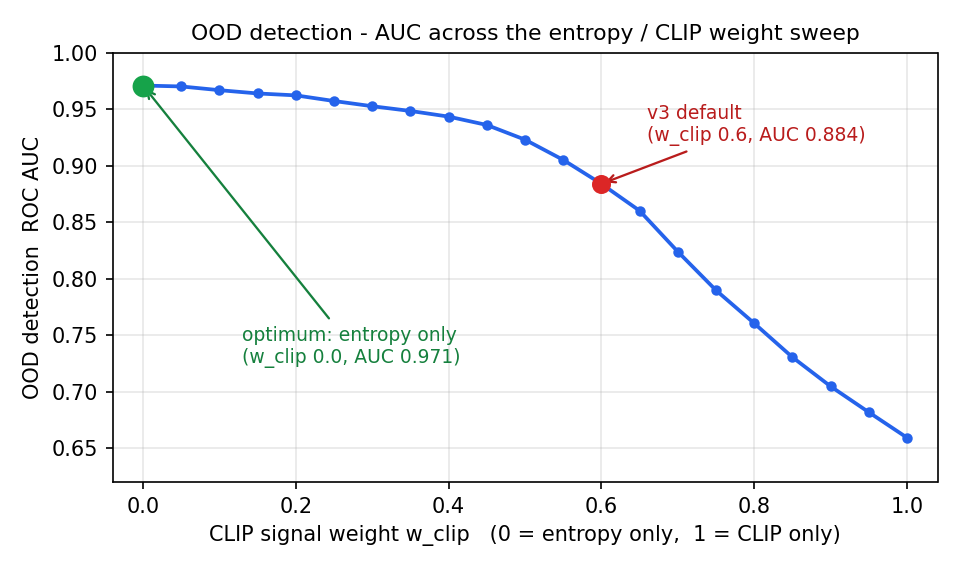

# Mini-LLaVA v4 — 8GB 노트북 GPU 한 장에서 조립·학습한 비전-언어 모델

CLIP 비전 인코더와 Qwen2.5-1.5B 언어 모델을 직접 이어 붙여 만든 소형 비전-언어 모델(VLM)입니다. HuggingFace 의 `LlavaForConditionalGeneration` 같은 통합 클래스를 쓰지 않고, 이미지 임베딩을 텍스트 시퀀스에 끼워 넣는 융합 로직을 저수준에서 직접 구현했습니다. 학습은 RTX 4060 Laptop 8GB 한 장에서 QLoRA 4-bit 로 진행했습니다.

LLaVA-1.5 구조를 **소비자용 GPU 한 장**이라는 제약 안에서 재현해 보는 학습용 프로젝트입니다. 8GB VRAM 과 약 9만 개의 학습 샘플(LLaVA-1.5 는 120만+)로 어디까지 되는지 확인하는 것이 목표이고, SOTA 성능이 목표는 아닙니다. v1→v4 로 이어진 시리즈의 마지막 버전이며, v3 대비 가장 큰 변경은 LLM 을 0.5B 에서 1.5B 로 키운 것입니다.

## 🏗️ 구조 (Architecture)

이미지를 CLIP 으로 인코딩하고, projector 로 LLM 의 임베딩 공간에 맞춘 뒤, 텍스트 시퀀스의 `<image>` 자리에 그 patch 임베딩을 끼워 넣어 Qwen2.5 가 함께 처리합니다.

- **비전** — CLIP-ViT-B/32, frozen. 224px 입력을 49개 patch × 768-d 로 인코딩.
- **Projector** — 2-layer MLP (768 → 1536, GELU), 학습 대상. LLaVA-1.5 의 `mlp2x_gelu` 와 동일.
- **LLM** — Qwen2.5-1.5B-Instruct. 4-bit NF4 로 frozen 하고 LoRA(r=16) 만 학습.

## 🔧 직접 구현한 부분 (Implementation)

VLM 의 핵심인 이미지-텍스트 융합을 고수준 라이브러리에 맡기지 않고 직접 다뤘습니다.

- **임베딩 splice (`src/model.py`)** — 입력 시퀀스에서 `<image>` 토큰 위치를 찾아 그 자리를 projector 가 낸 49개 patch 임베딩으로 교체합니다. text·attention_mask·label 을 모두 일관되게 재정렬하는 `_merge` 를 직접 구현했습니다.
- **QLoRA 로 8GB fit** — Qwen2.5-1.5B 를 fp32 로 올리면 가중치만 6GB 라 학습 자체가 불가능합니다. bitsandbytes 4-bit NF4 + double quantization 으로 base 를 압축하고 gradient checkpointing 으로 activation 메모리를 줄여 batch_size 1 로 학습했습니다. 학습 대상인 projector·LoRA 는 fp32 master weight 로 둬 업데이트 정밀도를 유지했습니다.
- **`<image>` 토큰 재사용** — 새 토큰을 추가하는 대신 Qwen2.5 에 내장된 `<|image_pad|>` 를 그대로 썼습니다. `resize_token_embeddings` 를 호출하지 않으므로, v3 에서 겪었던 "embedding resize → PEFT 가 `embed_tokens` 를 통째로 저장 → adapter 1GB" 문제가 생기지 않습니다. splice 는 토큰의 *위치*만 쓰므로 임베딩 품질과 무관합니다.
- **instruction-only label masking (`src/dataset.py`)** — system·user 토큰은 `IGNORE_INDEX` 로 가리고 assistant 응답 토큰에만 loss 를 줍니다.

## 🧪 학습 (Training)

LLaVA-1.5 의 2단계 학습을 따랐습니다 — 먼저 projector 만 정렬하고, 그 위에서 LoRA instruction tuning.

| | Stage 1 — 정렬 | Stage 2 — instruction |
|---|---|---|
| 학습 대상 | projector 3.5M | projector + LoRA = 22.0M |
| 데이터 | 40K (이미지 2만 장 × 캡션 2) | 46K 믹스 |
| step / 시간 | 5,000 / ≈3.3h | 5,750 / ≈7.4h |
| loss | 5.0 → 1.98 | 3.65 → ≈1.01 |

- batch_size 1 + grad_accum 8 (effective batch 8), gradient checkpointing ON. Stage 1·2 모두 OOM 없이 완주했습니다.
- Stage 2 믹스는 VQAv2 18K(짧은 사실) + LocalizedNarratives 10K(긴 묘사) + A-OKVQA 6K(추론) + KoLLaVA 12K(한국어). 한 능력에 치우치지 않도록 의도적으로 섞었습니다.
- 학습 루프 `src/train.py` — cosine LR + warmup, grad clipping, 중간 체크포인트 저장.

## 📊 결과 (Results).

### 정량 평가 — VQAv2 · POPE

학습된 raw 모델(추론 wrapper 없음)을 `scripts/eval_gate.py` 로 평가했습니다 — VQAv2 val / POPE test 각 n=400, greedy decoding.

| 지표 | v3 raw | **v4 raw** |
|---|---|---|
| VQAv2 정답률 | 36.7% | **56.8%** |
| POPE 정답률 | 50.0% | **71.8%** |
| POPE yes-F1 | — | **0.74** |

v3 는 POPE 에서 전부 "yes" 만 답해 사실상 랜덤(50%)이었고, v4 는 yes 227 / no 173 으로 양쪽을 실제로 가립니다. VQAv2 를 유형별로 보면 yes/no 76% · 개방형 46% · 숫자 43% — 짧은 사실형에 강하고 개방형·숫자에 약합니다.

다만 **절대 수치로는 공개 소형 VLM(보통 VQAv2 70%대+, POPE 85%+)에 못 미칩니다.** 8GB·약 9만 학습 샘플의 제약을 그대로 반영한 결과이고, 평가 하네스가 달라 외부 모델과 직접 비교하기는 어렵습니다 (v3 수치도 이전 저장소의 소표본 측정값).

배포는 사전에 정한 게이트를 통과해야만 진행했습니다 — v3 에서 검증 없이 배포했다 성능 미달을 라이브에서 발견한 경험 때문입니다. 통과 기준(VQAv2 ≥0.45, POPE ≥0.65 등 5개)은 SOTA 가 아니라 "v3·랜덤보다 분명히 위" 라는 최소선이고, raw 모델이 5개를 모두 통과했습니다.

### 라이브 데모 — 배포된 HF Space 점검

[HF Space](https://huggingface.co/spaces/AD-Styles/mini-llava-v4-demo) 에 영어/한국어·in-dist/OOD 10케이스를 입력해 실제 동작을 확인했습니다 (`scripts/smoke_space_demo.py`).

| 입력 | 질문 | 모델 응답 | 판정 |
|---|---|---|---|
| 장면 (EN) | What room is this? | "Kitchen." | ✅ |
| Yes/No (EN) | Is the boy wearing headphones? | "Yes." | ✅ |
| 행동 (EN) | What is the boy doing? | "Typing." | ✅ |
| 객체 (EN) | What is in this image? | "Person." | ✅ |
| 세부 구분 (EN) | What animal is the woman holding? | "Dog." | ❌ 실제 고양이 |
| 묘사 (EN) | Describe this image. | "In this picture we can see the kitchen…" | △ 형식만 유창 |
| 사실 (KO) | 이 사진에 무엇이 보이나요? | "한 여성이 칼로 피자를 썰고…" | △ 장황 |
| 묘사 (KO) | 이미지를 한국어로 설명해 주세요. | "한 남성이 주방에서…" | ❌ 성별·배경 환각 |
| OOD·만화 | What is in this image? | "Girl." | ⚠️ 분포 밖, 확신 응답 |
| OOD·추상화 | What do you see in this picture? | "Birds." | ❌ 분포 밖, 오답 |

CPU 추론이라 케이스당 10~66초가 걸리고, 샘플링 디코딩이라 실행마다 답이 조금씩 달라집니다. 정리하면 — 장면·yes/no·단순 객체 같은 짧은 사실형은 안정적이고, 세밀한 구분과 장문 묘사는 약하며(형식은 유창하나 없는 디테일을 지어냄), 분포 밖 입력은 거르지 않고 자신있게 답합니다.

## 🔍 OOD 검출 (OOD Detection)

분포 밖 입력(만화·추상화)에 모델이 자신있게 틀리는 문제를 별도로 분석했습니다. CLIP image-text 유사도와 LLM 첫 토큰 entropy 두 신호를 100케이스(in-dist 40 + 만화 30 + 추상화 30)로 ROC 비교했습니다 (`scripts/ood_roc_analysis.py`).

entropy 단독(w_clip=0)이 AUC **0.971** 로 가장 강했고, CLIP 신호를 섞을수록 단조 감소했습니다(CLIP 단독 0.66). 5-fold 교차검증 0.969 로 과적합이 아님을 확인했고, 최적 임계값에서 판정 정확도는 91% 입니다. 단 이 검출기는 오프라인 분석용입니다 — 배포된 데모에는 적용하지 않았고, 데모는 raw 모델만 서빙하므로 위 추상화 사례처럼 OOD 입력에 그대로 답합니다.

## 💡 회고록 (Retrospective)

v1 부터 네 번에 걸쳐 만들면서 배운 것과, v4 를 마치며 남기는 솔직한 평가입니다.

**시리즈가 가르쳐 준 것.** v1·v2 에서 CLIP·projector·LLM 을 잇는 기본 구조를 만들었습니다. v3 에서는 모델이 시각 detail 에 약한 원인을 0.5B LLM 으로 진단하고, CLIP grounding·OOD router 같은 추론 wrapper 로 점수를 끌어올려 배포했습니다 — 그런데 wrapper 가 올린 점수의 상당 부분은 모델 능력이 아니라 routing 이었고, raw 모델의 약함을 가리고 있었습니다. v4 는 두 가지를 바꿨습니다. LLM 을 1.5B 로 키워 raw 모델 자체를 강화했고, v3 의 진단을 다시 따져 병목의 절반은 LLM 크기가 아니라 **학습 데이터 규모**(Stage 1 정렬이 5K — LLaVA 의 1%)였음을 확인했습니다. 시행착오는 v1~v3 의 몫이었고, v4 는 그 교훈을 모아 적용한 버전입니다.

**구체적으로 배운 세 가지.**

- **검증은 배포 앞에 와야 한다.** v3 는 학습 직후 배포하고 성능 문제를 라이브에서 발견했습니다 — 순서가 틀렸습니다. v4 는 통과 기준을 배포 *전에* 고정하고, raw 모델이 그 기준을 넘어야만 배포되도록 게이트를 절차에 넣었습니다.
- **도구가 왜 그렇게 동작하는지 알아야 한다.** v3 의 LoRA adapter 가 1GB 까지 부푼 건, 새 토큰을 추가하면 `embed_tokens` 저장까지 연쇄된다는 걸 그때는 몰랐기 때문입니다. v4 는 Qwen2.5 내장 토큰을 재사용해 그 연쇄를 처음부터 끊었습니다 — 버그를 *고치는* 게 아니라 *안 만드는* 방향입니다.
- **평가에서 데이터가 새면 숫자가 거짓말을 한다.** v3 는 POPE 판정 임계값을 test set 으로 튜닝했고, 그렇게 나온 70% 는 일반화를 보장하지 못했습니다 (튜닝 전엔 53%). v4 는 train/test 를 분리해 이 문제를 없앴습니다.

**v4 를 마치며.** v4 는 목표한 것을 해냈지만 성능 자체는 제한적입니다. VQAv2 56.8% / POPE 71.8% 는 공개 소형 VLM 에 못 미치고, 1.5B·8GB·약 9만 샘플이라는 천장은 더 큰 모델이나 수십만 규모 데이터 없이 넘기 어렵습니다. 다시 한다면, 게이트·OOD ROC 같은 평가 작업도 의미는 있었지만 그중 일부 시간을 Stage 1 정렬 데이터를 더 키우는 데 썼을 겁니다 — 데이터 규모가 병목의 절반이라는 걸 비교적 늦게 깨달았기 때문입니다. 한국어도 학습 데이터는 4K→12K 로 늘렸으나 신뢰할 표준 벤치마크가 없어 정량 평가셋은 만들지 못했습니다. 배포 면에서는 학습(4-bit)과 무료 CPU 데모(fp32) 사이의 정밀도 절충이 남아 있습니다 (`scripts/diag_deploy_gap.py` 비교상 답변 차이는 거의 없음).

## 🔗 링크 (Links)

- 데모 — [HF Space: mini-llava-v4-demo](https://huggingface.co/spaces/AD-Styles/mini-llava-v4-demo) (무료 CPU 티어, 응답에 수십 초)
- 가중치 — [HF Hub: mini-llava-v4](https://huggingface.co/AD-Styles/mini-llava-v4)
- 이전 버전 — [v3](https://github.com/AD-Styles/vlm-from-scratch-v3) · [v2](https://github.com/AD-Styles/vlm-from-scratch)
- 참고 — Dettmers et al., *QLoRA: Efficient Finetuning of Quantized LLMs* (NeurIPS 2023)
